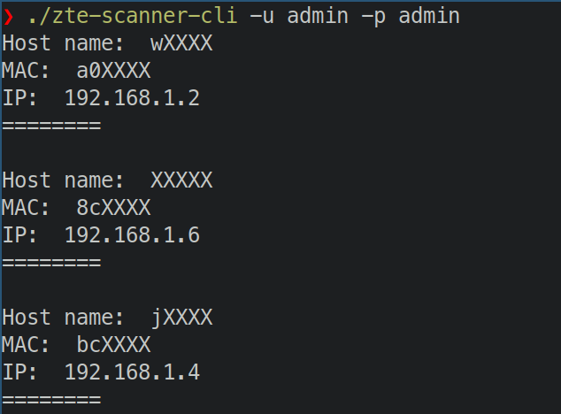

# zteScanner


A go library to get connected 
devices from a ZTE ZXHN F670L WiFi Router.
This probably won't work for toher models.

This repo also contains a cli tool 
and a telegram bot based on this library.


## Why
I wanted to get connected devices to 
my WiFi router as fast as I could.
Tools like arp-scanner, nmap 
took sometime and was hit or miss.

This library basically scraps ZTE dashboard and
extract the connected devices, along with their
IP Address, hostname and MAC Address.

## Usage
### cli
```
zte-scanner -u <username> -p <password>
```



### library
```
    scanner := zteScanner.New("http://192.168.1.1", "username", "password")
    /*
    All methods   
                scanner.GetDevices()
                scanner.GetDevicesAlive() -> get devices and perform ping scan
                scanner.GetDevicesForce() -> logout others, login and scan
                scanner.GetDevicesAliveForce()

    */
    devs, err := scanner.GetDevices()

	if err != nil {
		log.Fatal(err)
	}

	for _, device := range devices {
		fmt.Println("Host name: ", device.Hostname)
		fmt.Println("MAC: ", device.MacAddress)
		fmt.Println("IP: ", device.IPAddress)
		fmt.Printf("========\n\n")
	}

```

## Build
## cli
```
make cli/build
```

## bot
```
make bot/build
```

## Features
* gets clients in less than 0.5s
* Optional Ping scan to check if devices are alive
* hostname, ip and mac address

## NOTE
Setting up  telegram bot with admin access 
to your wifi router is a bad idea.

